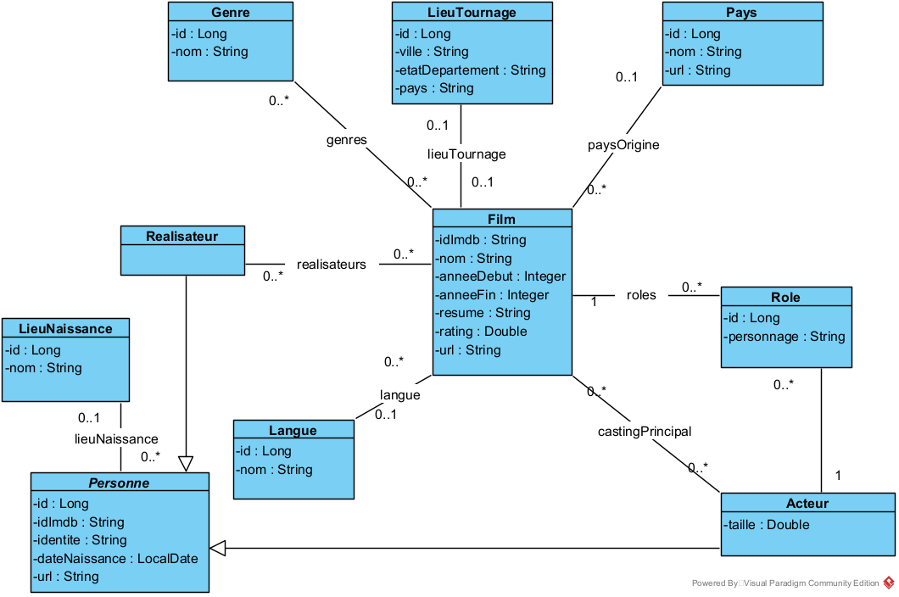
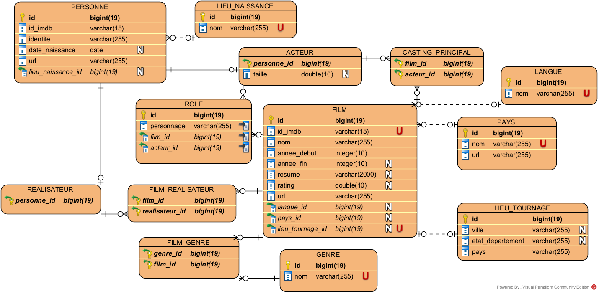

# Cinéma JPA

Projet Java réalisé dans le cadre de ma formation **Concepteur Développeur d'Applications (CDA)**.

L'application importe des données cinématographiques depuis plusieurs fichiers CSV, les enregistre dans une base MariaDB avec JPA/Hibernate, puis permet de les interroger depuis des applications console.

## Fonctionnalités

### Import des données

`InitialisationJpa` permet d'importer :

- les pays ;
- les acteurs ;
- les réalisateurs ;
- les films ;
- les rôles ;
- le casting principal ;
- les associations entre films et réalisateurs.

Les genres, langues, lieux de naissance et lieux de tournage sont également créés à partir des données importées.

Les données de référence sont normalisées afin de limiter les doublons liés notamment à la casse, aux accents et aux espaces.

Chaque phase d'import est exécutée dans sa propre transaction. En cas d'erreur pendant une phase, la transaction correspondante est annulée.

### Recherches

`RechercheJpa` propose six recherches :

1. afficher la filmographie d'un acteur ;
2. afficher le casting principal d'un film ;
3. rechercher les films sortis entre deux années ;
4. rechercher les films communs à deux acteurs ;
5. rechercher les acteurs communs à deux films ;
6. rechercher les films d'un acteur sur une période donnée.

L'application prend également en compte plusieurs cas particuliers :

- saisie d'une valeur non numérique ;
- période de recherche incohérente ;
- plusieurs acteurs portant le même nom ;
- plusieurs films portant le même titre ;
- absence de casting principal dans les données.

### CRUD

`CrudJpa` permet de gérer les genres depuis une application console :

- création d'un genre ;
- consultation d'un genre par son identifiant ;
- affichage de tous les genres ;
- modification ;
- suppression.

## Architecture

Le projet est organisé en plusieurs couches :

```text
src/main/java/fr/diginamic/cinema
├── dao
├── entite
├── service
├── util
├── InitialisationJpa.java
├── RechercheJpa.java
└── CrudJpa.java
```

- **entite** : modèle métier et mapping JPA ;
- **dao** : accès aux données et requêtes JPQL ;
- **service** : logique métier et gestion des transactions ;
- **util** : méthodes utilitaires ;
- **applications console** : initialisation, recherches et CRUD.

## Modélisation

Le modèle repose notamment sur :

- une classe abstraite `Personne`, dont héritent `Acteur` et `Realisateur` ;
- une entité `Role` reliant un acteur à un film et au personnage interprété ;
- des relations plusieurs-à-plusieurs pour les genres, réalisateurs et acteurs du casting principal ;
- une relation plusieurs-à-un entre `Film` et `Langue` ;
- une relation plusieurs-à-un entre `Film` et `Pays` ;
- une relation plusieurs-à-un entre `Personne` et `LieuNaissance` ;
- une relation un-à-un entre `Film` et `LieuTournage`.

L'héritage JPA entre `Personne`, `Acteur` et `Realisateur` utilise la stratégie `JOINED`.

La conception du projet est détaillée dans le
[README du dossier conception](conception/README.md).

## Diagramme de classes



## Modèle physique de données



## Technologies

- Java 21
- Maven
- Jakarta Persistence
- Hibernate ORM
- MariaDB
- Apache Commons CSV
- Logback
- JUnit

## Tests

Le projet contient **11 tests unitaires** portant principalement sur les méthodes qui maintiennent les relations entre les entités.

Ils vérifient notamment :

- l'ajout et la suppression d'un genre ;
- l'ajout et la suppression d'un réalisateur ;
- l'ajout et la suppression d'un acteur du casting principal ;
- l'ajout d'un rôle côté `Film` et côté `Acteur` ;
- l'association d'un lieu de tournage ;
- le remplacement d'un lieu de tournage ;
- la suppression d'un lieu de tournage.

Pour lancer les tests :

```bash
mvn test
```

## Prérequis

- Java 21
- Maven
- MariaDB
- une base de données nommée `cinema`

## Configuration

La configuration JPA se trouve dans :

```text
src/main/resources/META-INF/persistence.xml
```

La configuration utilisée en local est :

```text
URL : jdbc:mariadb://localhost:3306/cinema
Utilisateur : root
Mot de passe : vide
```

Le schéma doit être créé avant de lancer l'import, la génération automatique de la base étant désactivée.

## Lancement

### 1. Importer les données

Lancer :

```text
fr.diginamic.cinema.InitialisationJpa
```

### 2. Effectuer les recherches

Lancer :

```text
fr.diginamic.cinema.RechercheJpa
```

### 3. Tester le CRUD

Lancer :

```text
fr.diginamic.cinema.CrudJpa
```

## Données sources

Les fichiers CSV utilisés pour l'import se trouvent dans :

```text
src/main/resources/csv
```

Fichiers présents :

```text
acteurs.csv
castingPrincipal.csv
film_realisateurs.csv
films.csv
pays.csv
realisateurs.csv
roles.csv
```

## Conception

Le dossier `conception` contient :

```text
conception
├── 01-diagramme-de-classes.png
├── 02-modele-physique-donnees.png
├── README.md
├── decisions-conception.md
└── sources
    └── cinema-conception.vpp
```

Il regroupe :

- le README consacré à la conception ;
- le diagramme de classes UML ;
- le modèle physique de données ;
- le détail des décisions de conception ;
- le fichier source Visual Paradigm.
